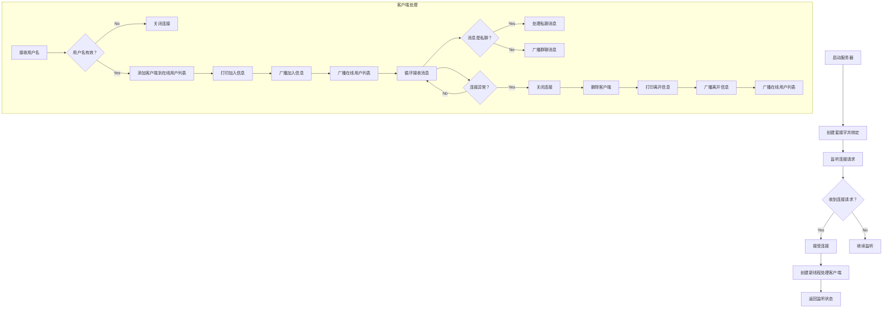
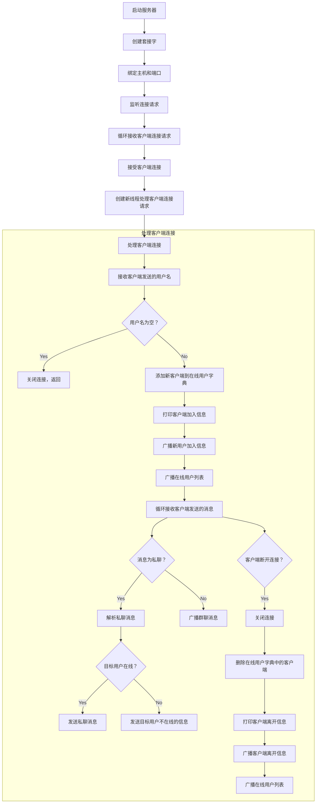
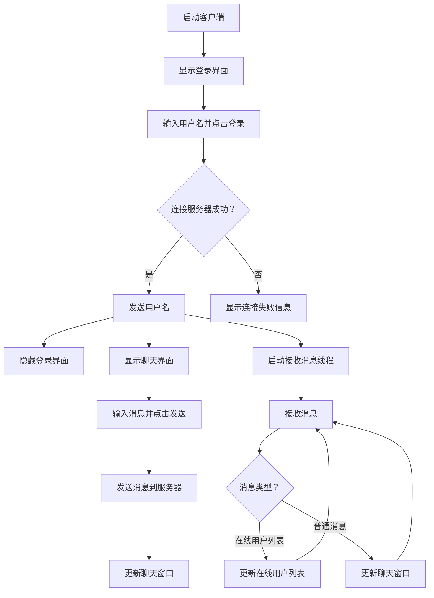

# 1、实验名称：
***socket通讯程序开发实验***

# 2、实验目的：
* 使用一种熟悉的编程语言，开发一个使用Socket 通讯的程序，平台不限(PC或手机均可)
* 程序需要有一定的功能(例如:聊天室、照片分享程序、网络对战五子棋等)，代码要保证原创性。
* 通过此次实验，对计算机网络通信原理的理解，并提升编程实践能力。←

# 3、程序功能：
* 有图形用户界面，基于Tkinter实现。
* 能处理并发请求的服务端，基于threading模块实现。服务端能处理并发请求，每当有客户端请求连接时，服务端都会开启一个线程进行处理，因此当有多个客户端同时请求服务时不会造成阻塞。
* 实现用户名登录功能。用户输入用户名就可以进入到聊天室。
* 公共聊天功能。任何已登录的用户都能在聊天窗口发送消息,且该消息能被其他所有在线用户看到。
* 私人聊天功能。所有已登录的用户都显示在在线用户列表中,用户可以通过规定的私聊信息格式进行私聊。←

# 4、服务端讲解
## 4.1服务端逻辑流程
### 版本1

### 版本2

# 5、客户端讲解
## 5.1客户端逻辑流程

# 6、参考资料
* [菜鸟教程：Python网络编程](https://www.runoob.com/python/python-socket.html)
* [菜鸟教程：Python多线程](https://www.runoob.com/python/python-multithreading.html)
* [菜鸟教程：Python GUI编程 Tkinter](https://www.runoob.com/python/python-gui-tkinter.html)

  
